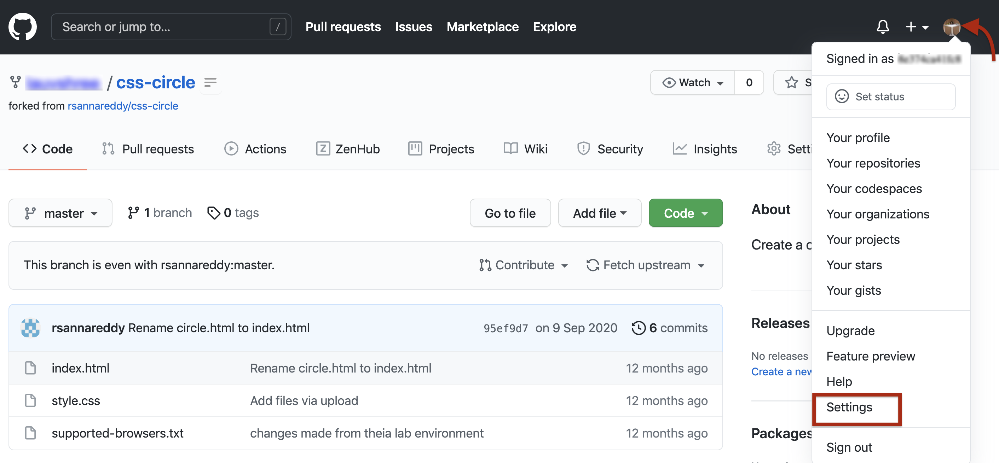
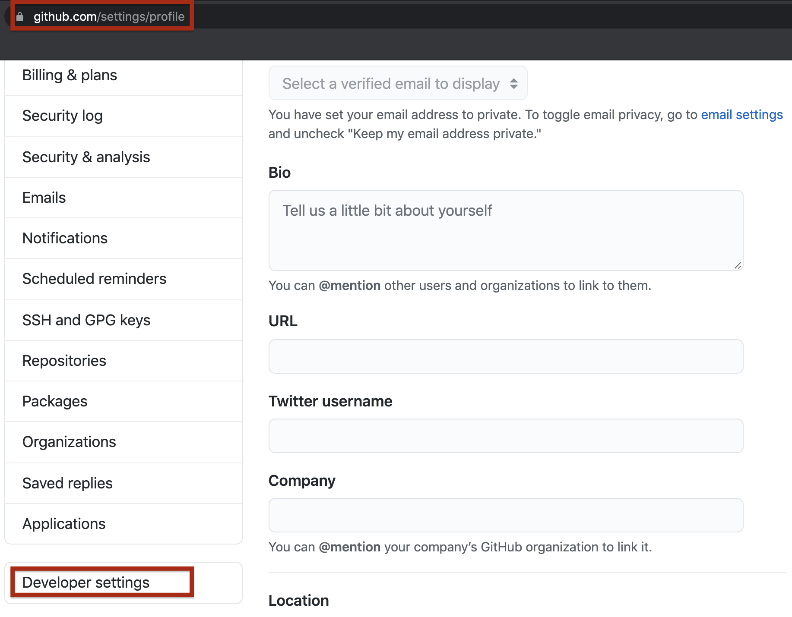
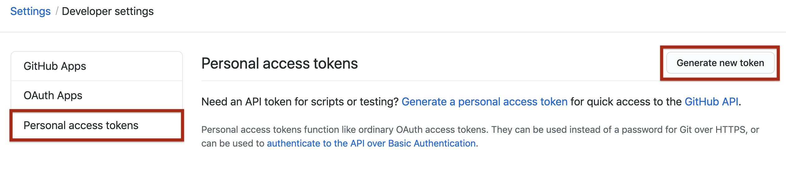
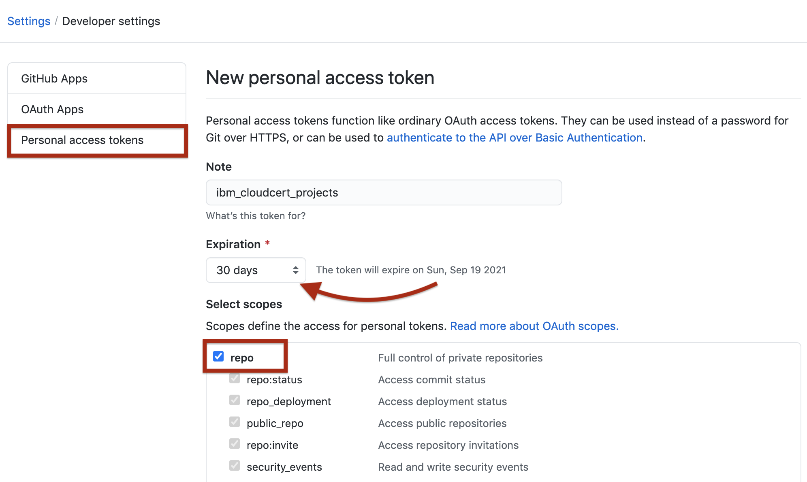
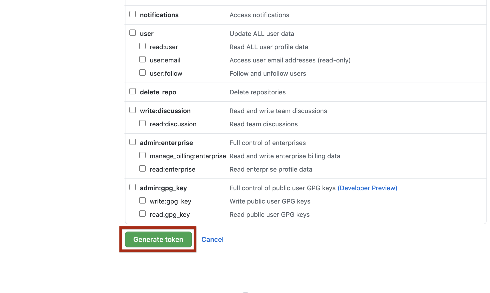
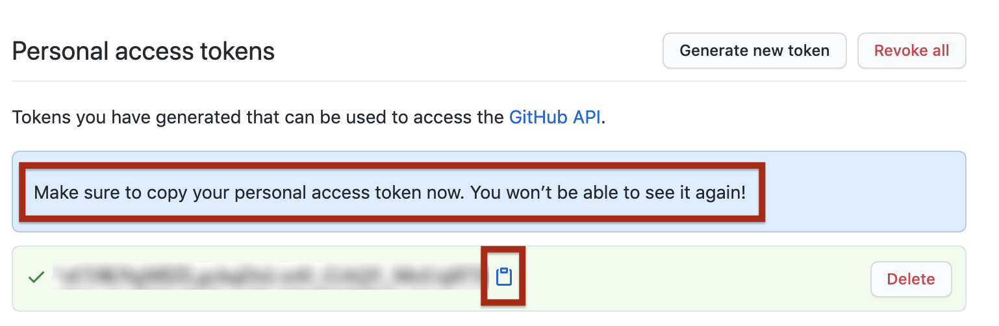

# Commit and Push the code to GitHub
When you are done with all the changes in the project go through the below instructions to learn how to commit and push to GitHub.
## Step 1 - Review changes to the repo
To review the changes that have been made to the repo, run the following commands in the terminal:

```
   cd [your repo name]
   git init
   git status
```

The `git status` command will display all the changes you have made to this point.

The changed files will be displayed. Choose the files which you want to push to the repository.

## Step 2 - Mark the changes for commit
You now need to commit the changes you’ve made. Before you can do that, you need to add the new and revised files to the commit:

2.1 Run the following commands to add the files to git tracking:
```
   git add .
```

2.2 After adding the files, run git status again. You will see output similar to that in the following image:

## Step 3 - Commit the changes
Because this is first time you're using git, you need to set your display name and email so you can commit the changes:

3.1 Run the following commands, substituting your email and display name:
```
git config --global user.email protadtv@gmail.com
git config --global user.name "Pro Tad TV"
```


You are now able to commit the changes you've made using git.

3.2 Run the following command to commit the changes. You will pass a commit message using the -m option.
```
git commit -m 'Initial Commit'
```

## Step 4 - Generate Personal Access Token
4.1 Verify your email address if it hasn't been verified on Github. 

4.2 In the upper-right corner of any page, click your profile photo, then click Settings.

4.3 In the left sidebar, click Developer settings.

4.4 In the left sidebar, click Personal access tokens and click on `Generate Tokens`

4.5 Give your token a descriptive name. To give your token an expiration, select the Expiration drop-down menu, then click a default or use the calendar picker. Select the scopes, or permissions, you'd like to grant this token. To use your token to access repositories from the command line, select repo.

4.6 Click Generate token and make a note of it.

4.7 Make sure you copy the token and keep it safe. It is not visible to you again. 

Treat your tokens like passwords and keep them a secret.

Once you have a token, you can enter the Personal Access Token as password when performing Git operations.

## Step 5 - Push the code to GitHub
The git `push` command will enable you to sync all the changes made locally to the GitHub web repository.

5.1 Run the following command with your actual HTTPS link:
```
 git push --set-upstream https://gitlab.com/bluebayhitechlab/git_guide.git master
```
You will be prompted by git for your username and password.

5.2 Type your GitHub username and for the password, enter the personal access token you generated in the previous task. When you are authenticated, all committed changes are synced with your GitHub repository.
You can now visit the GitHub repository page and check to ensure that the revised and newly added files are in place.

## Summary
Congratulations! You should now know how to access git and run commands from the command line using the Theia lab environment.

In this lab, you have learned how to:

Commit the changes
Push the updated files to GitHub
We encourage you to make more changes to your files to become familiar with git, GitHub, and running commands from command line.

## Donation

***If you find this content useful, you can donate our dedicated team here. Thank you!***

Network:
```
Bitcoin
```
BTC Deposit Address:
```
bc1qm5xtp8uqhzuau2u9yvjhx9nztqtkgnfq7gzuwd
```
## License

**BlueBay Hi-Tech** [https://bluebayhitech.com/](https://bluebayhitech.com/)